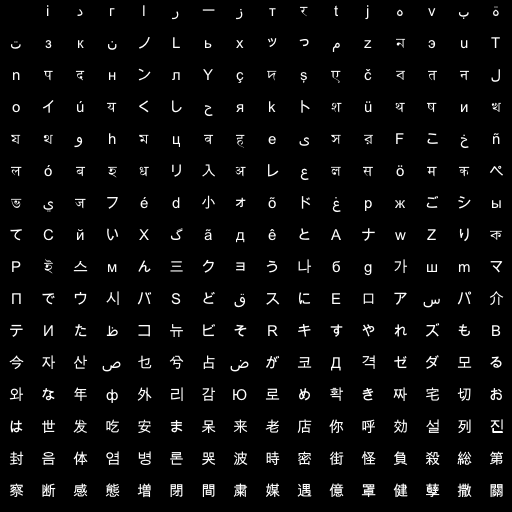

# 8bit Alphabet

Numbering system with 256 characters ordered by brightness levels: 

```
撒健億媒間増感察総負街時哭병体封列効你老呆安发は切짜확로감外年와모ゼДが占乜산今
もれすRビコたテパアEスどバウПm가бうクん스РりwАêãХйてシжغõ小éजভकöলレ入धबल
خFসeवমوযиथशkحくúoनবएদYンदnuনمッьノкتبهtт一ادіاгرزरjvةзنLxっzэTपнлçş
čतلイयしяトüषখথhцहیরこñóহリअعसमペيフdォドрごыСいگдとナZকইм三ョ나gшマで시
Sقに口س介Иظ뉴そキやズВ자ص兮ض코격ダるなф리Юめき宅お世吃ま来店呼설진음염론波密怪
殺第断態閉粛遇罩孽關警
```


